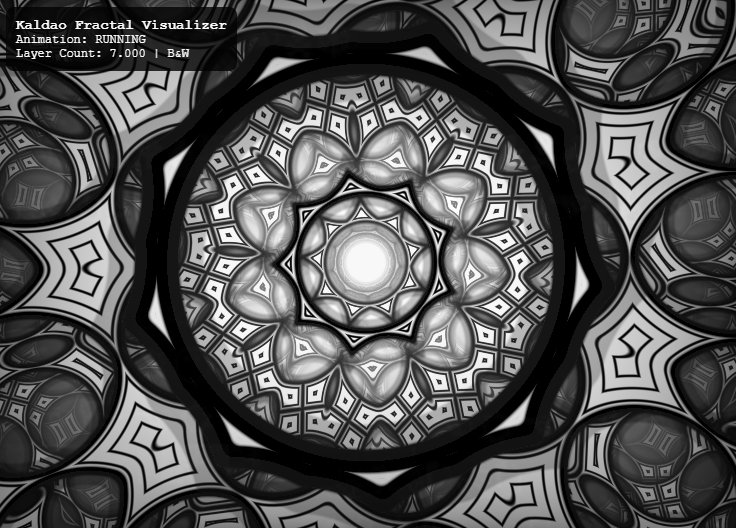

# Kaldao Fractal Visualizer

An interactive fractal visualization application that creates kaleidoscopic patterns with real-time audio reactivity and comprehensive mobile support. Built with WebGL for high-performance rendering.



## 🌟 Features

### Core Visualization
- **Real-time fractal rendering** with GPU acceleration
- **16 adjustable parameters** affecting movement, visuals, camera, and colors
- **Enhanced kaleidoscope system** with up to 200 mirror segments
- **Layered depth rendering** with configurable transparency and blending
- **Smooth camera path system** with curved tunnel movement

### Audio Integration
- **Audio-reactive visuals** supporting file upload and live microphone input
- **Advanced frequency analysis** mapping bass, mid, and treble to different parameters
- **Real-time parameter modulation** with audio multipliers
- **Multiple audio format support** (MP3, WAV, OGG, M4A, AAC)

### Mobile Experience
- **Touch gesture controls** with intuitive swipe and pinch interactions
- **Device orientation support** for camera tilt control
- **Shake detection** for parameter randomization
- **Mobile-optimized UI** with responsive design
- **Auto-hiding interface** for immersive viewing

### Color System
- **7 built-in color palettes** (B&W, Rainbow, Fire, Ocean, Purple, Neon, Sunset)
- **Custom palette generation** with real-time randomization
- **Color inversion effects** and intensity control
- **Dynamic color cycling** synchronized with audio

### User Experience
- **Save/Load system** for parameter configurations
- **Undo/Redo functionality** with 50-step history
- **URL sharing** for quick parameter distribution
- **Preset system** for storing favorite configurations
- **Auto-fade controls** for distraction-free viewing

## 🚀 Quick Start

### Desktop Setup
1. **Local Development**: Serve files from a local web server
   ```bash
   # Using Python
   python -m http.server 8000
   
   # Using Node.js
   npx serve .
   
   # Using PHP
   php -S localhost:8000
   ```

2. **Open in browser**: Navigate to `http://localhost:8000`

3. **Start exploring**: Use arrow keys to navigate parameters, or press `ESC` for full parameter menu

### Mobile Setup
1. **Direct Access**: Open the URL on your mobile device
2. **Add to Home Screen**: For the best experience, add to your device's home screen
3. **Grant Permissions**: Allow device orientation and microphone access when prompted

## 🎮 Controls

### Desktop Controls

#### Navigation
- **↑/↓** - Switch between parameters (when menu closed) / Navigate parameters (when menu open)
- **←/→** - Cycle parameters (when menu closed) / Adjust values (when menu open)
- **Mouse Wheel** - Zoom in/out
- **ESC** - Toggle full parameter menu

#### Randomization & Reset
- **C** - Randomize colors
- **Shift+C** - Reset to black & white
- **R** - Reset current parameter to default
- **Shift+R** - Reset all parameters (with confirmation)
- **.** (Period) - Randomize all parameters

#### Audio
- **A** - Upload audio file / toggle playback
- **M** - Toggle microphone input for live audio reactivity

#### File Operations
- **S** - Save current parameters to JSON file
- **L** - Load parameters from JSON file

#### Other
- **I** - Invert colors
- **Space** - Pause/resume animation
- **Ctrl+Z** - Undo last change
- **Ctrl+Y** - Redo last undone change

### Mobile Controls

#### Touch Gestures
- **Single Tap** - Toggle parameter menu
- **Horizontal Swipe** - Switch between parameters
- **Vertical Drag** - Adjust current parameter value (fader-style)
- **Long Press (2s)** - Reset all parameters
- **Two-Finger Tap** - Randomize colors
- **Pinch Gesture** - Zoom in/out

#### Device Controls
- **Shake Device** - Randomize all parameters
- **Tilt Device** - Control camera tilt (X/Y axes)
- **Device Orientation** - Automatic camera adjustment

## 📊 Parameters

### Movement & Animation (4 parameters)
- **Fly Speed** (-3.0 to 3.0) - Camera movement speed through the fractal
- **Rotation Speed** (-6.0 to 6.0) - Speed of pattern rotation
- **Plane Rotation Speed** (-5.0 to 5.0) - Speed of layer rotation
- **Zoom Level** (-5.0 to 5.0) - Fractal zoom/scale factor

### Pattern & Visual (6 parameters)
- **Kaleidoscope Segments** (4 to 200) - Number of symmetrical segments
- **Truchet Radius** (-1.0 to 1.0) - Size of truchet pattern elements
- **Center Fill Radius** (-2.0 to 2.0) - Radius of center fill effect
- **Layer Count** (1 to 10) - Number of rendered layers
- **Contrast** (0.1 to 5.0) - Visual contrast intensity
- **Color Intensity** (0.1 to 2.0) - Overall color brightness

### Camera & Path (5 parameters)
- **Camera Tilt X/Y** (-10.0 to 10.0) - Camera angle adjustments
- **Camera Roll** (-π to π) - Camera rotation around view axis
- **Path Stability** (-1.0 to 1.0) - Smoothness of camera path (curved to straight)
- **Path Scale** (-3.0 to 3.0) - Scale of camera movement path

### Color & Effects (1 parameter)
- **Color Speed** (0.0 to 2.0) - Speed of color animation

## 🎵 Audio Reactivity

The visualizer features advanced audio analysis that maps different frequency ranges to specific visual parameters:

### Frequency Mapping
- **Bass (20-250Hz)** → Center fill radius, Truchet radius, Zoom level
- **Mid (250-2000Hz)** → Rotation speeds, Fly speed
- **Treble (2000-8000Hz)** → Kaleidoscope segments, Color intensity
- **Overall Volume** → Contrast, Layer count, Path effects

### Audio Sources
1. **File Upload**: Support for common audio formats with automatic looping
2. **Live Microphone**: Real-time audio input with device permission
3. **Audio Processing**: Advanced FFT analysis with smoothing and sensitivity controls

## 🎨 Color Palettes

### Built-in Palettes
1. **B&W** - Classic black and white
2. **Rainbow** - Full spectrum colors
3. **Fire** - Warm oranges and reds
4. **Ocean** - Cool blues and teals
5. **Purple** - Rich purples and magentas
6. **Neon** - Bright electric colors
7. **Sunset** - Warm sunset tones

### Palette Features
- **Custom randomization** - Generate unique color schemes
- **Real-time editing** - Colors respond to audio and time
- **Palette cycling** - Smooth transitions between color schemes
- **Inversion effects** - Instant negative image effects

## 🔧 Development

### Project Structure
```
kaldao-fractal/
├── index.html              # Main HTML page
├── css/                    # Stylesheets
│   ├── main.css           # Core styles and mobile support
│   ├── ui.css             # UI component styles  
│   └── menu.css           # Menu and overlay styles
├── js/                     # JavaScript modules
│   ├── main.js            # Application initialization
│   └── modules/           # Core modules
│       ├── parameters.js  # Parameter management with audio modifiers
│       ├── audio.js       # Audio system and reactivity
│       ├── controls.js    # Desktop input handling
│       ├── mobile.js      # Mobile gesture controls
│       ├── renderer.js    # WebGL rendering
│       ├── ui.js          # UI management
│       └── fileIO.js      # Save/load functionality
├── shaders/               # GLSL shaders
│   ├── vertex.glsl        # Vertex shader
│   └── fragment.glsl      # Fragment shader with enhanced features
├── assets/                # Assets and presets
│   └── presets/           # Parameter preset files
└── README.md              # This file
```

### Adding New Parameters
1. Define parameter in `js/modules/parameters.js`
2. Add uniform to fragment shader if needed
3. Update UI categories in `js/modules/ui.js`
4. Add default value to reset functions

### Mobile Development
- Touch events are handled in `js/modules/mobile.js`
- Device orientation and motion APIs integrated
- Responsive CSS with mobile-first design
- Progressive enhancement for desktop features

### Browser Compatibility
- **WebGL**: WebGL 1.0 minimum, WebGL 2.0 preferred
- **Audio**: Web Audio API required for audio features
- **Mobile**: iOS 12+, Android 8+ recommended
- **Desktop**: Modern browsers (Chrome, Firefox, Safari, Edge)

## 🐛 Troubleshooting

### Common Issues

#### Shaders Not Loading
- Ensure running from web server (not `file://`)
- Check browser console for CORS errors
- Fallback shaders will load if external files fail

#### Audio Issues
- **Permission Denied**: Grant microphone permissions in browser settings
- **Autoplay Blocked**: Click/tap to start audio playback manually
- **No Audio**: Check supported formats: MP3, WAV, OGG, M4A, AAC

#### Performance Issues
- **Low FPS**: Reduce layer count and kaleidoscope segments
- **Mobile Lag**: Lower zoom level and contrast settings
- **Battery Drain**: Enable auto-hide UI and reduce visual complexity

#### Mobile Issues
- **Touch Not Working**: Ensure page is loaded over HTTPS
- **Orientation Issues**: Calibrate device orientation in settings
- **Shake Not Detected**: Use more vigorous shake gesture

### Performance Optimization
```javascript
// Recommended settings for mobile/low-end devices
layer_count: 4-6
kaleidoscope_segments: 8-16
contrast: 0.8-1.2
zoom_level: 0.1-0.5
```

## 🤝 Contributing

1. Fork the repository
2. Create feature branch (`git checkout -b feature/amazing-feature`)
3. Follow existing code style and architecture
4. Test on both desktop and mobile
5. Add documentation for new features
6. Submit pull request with clear description

### Development Setup
```bash
git clone https://github.com/your-repo/kaldao-web.git
cd kaldao-web
python -m http.server 8000  # or your preferred server
```

### Code Style
- ES6 modules with clear imports/exports
- Consistent naming: camelCase for variables, PascalCase for classes
- Comprehensive error handling with user feedback
- Mobile-first responsive design
- Progressive enhancement for advanced features

## 📄 License

Kaldao is released under the MIT License. See [Credits](#credits) for other projects' licensing terms.

## 🙏 Credits

- **Kaleidoscope**: Inspired by dao's [Kaleidoscope](https://godotshaders.com/shader/kaleidoscope/) godot shader
- **Truchet + Kaleidoscope FTW**: Based on mrange's [Truchet + Kaleidoscope FTW](https://www.shadertoy.com/view/7lKSWW) shader
- **Color Palettes**: Inigo Quilez's [palette techniques](https://iquilezles.org/www/index.htm)
- **Mirror Transforms**: mercury's [ModMirror](https://mercury.sexy/hg_sdf/)

## 📈 Version History

### v0.3.2 (Current)
- Complete mobile support with touch gestures
- Device orientation and motion integration
- Enhanced audio reactivity with modifier system
- Improved kaleidoscope algorithm (even segments)
- Auto-hiding UI for immersive experience
- URL sharing and preset system
- Comprehensive error handling

### Previous Versions
- v0.3.x: Enhanced parameter system and audio features
- v0.2.x: Modular architecture and improved rendering
- v0.1.x: Initial WebGL implementation

## ✅ TODO
- Live audio monitoring 
- Full mobile functionality
- Fix desktop menu
- True 3D and fractal dimensional shader
- More parameter fine-tuning
- Debug mode
- Accessibility features
- Comprehensive roadmap
---

**Experience the infinite beauty of mathematical art with real-time audio synchronization across all your devices.** 🌈✨